# Dependency graph

The full dependency graph of the Phase0 instruction set — from CLAUDE.md through contracts, skills, and agents.

```mermaid
graph TD
    %% ===== ENTRY POINT =====
    CLAUDE["CLAUDE.md"]

    %% ===== CONTRACTS: META =====
    subgraph meta["contracts/meta"]
        contract["contract.md"]
        contract_structure["contract-structure.md"]
        model_structure["model-structure.md"]
    end

    %% ===== CONTRACTS: PRINCIPLES =====
    subgraph principles["contracts/principles"]
        facilitator_role["facilitator-role.md"]
        modeling_foundation["modeling-foundation.md"]
        actor_lens["actor-lens.md"]
        usecase_lens["usecase-lens.md"]
        context_lens["context-lens.md"]
        evaluation["evaluation.md"]
        editorial["editorial-standards.md"]
        durable_capture["durable-capture.md"]
    end

    %% ===== CONTRACTS: FORMS =====
    subgraph forms["contracts/forms"]
        f_actor["actor.md"]
        f_catalog["catalog.md"]
        f_context["context.md"]
        f_evaluation["evaluation.md"]
        f_event["event.md"]
        f_glossary["glossary.md"]
        f_invariant["invariant.md"]
        f_note["note.md"]
        f_todo["todo.md"]
        f_usecase["usecase.md"]
    end

    %% ===== SKILLS =====
    subgraph skills_behavioral["skills — behavioral"]
        sk_grounding["grounding-models"]
        sk_discovering["discovering-actors"]
        sk_modeling["modeling-usecases"]
        sk_mapping["mapping-contexts"]
        sk_evaluating["evaluating-artifacts"]
        sk_composing["composing-prose"]
        sk_preserving["preserving-discoveries"]
        sk_navigating["navigating-models"]
    end

    subgraph skills_reading["skills — reading"]
        sk_r_actor["reading-actors"]
        sk_r_catalog["reading-catalogs"]
        sk_r_context["reading-contexts"]
        sk_r_eval["reading-evaluations"]
        sk_r_event["reading-events"]
        sk_r_glossary["reading-glossaries"]
        sk_r_invariant["reading-invariants"]
        sk_r_note["reading-notes"]
        sk_r_todo["reading-todos"]
        sk_r_usecase["reading-usecases"]
    end

    subgraph skills_writing["skills — writing"]
        sk_w_actor["writing-actors"]
        sk_w_catalog["writing-catalogs"]
        sk_w_context["writing-contexts"]
        sk_w_eval["writing-evaluations"]
        sk_w_event["writing-events"]
        sk_w_glossary["writing-glossaries"]
        sk_w_invariant["writing-invariants"]
        sk_w_note["writing-notes"]
        sk_w_todo["writing-todos"]
        sk_w_usecase["writing-usecases"]
    end

    %% ===== AGENTS =====
    subgraph agents["agents"]
        ag_usecases["designing-usecases"]
        ag_coherence["evaluating-coherence"]
        ag_references["evaluating-references"]
        ag_structure["evaluating-structure"]
        ag_style["evaluating-style"]
    end

    %% ===== CLAUDE.md @ references =====
    CLAUDE -->|"@"| facilitator_role
    CLAUDE -->|"@"| modeling_foundation
    CLAUDE -->|"@"| contract
    CLAUDE -->|"@"| contract_structure
    CLAUDE -->|"@"| model_structure
    CLAUDE -->|"@"| durable_capture
    CLAUDE -->|"@"| editorial

    %% ===== Meta cross-references =====
    contract -.-> contract_structure
    contract_structure -.-> model_structure

    %% ===== Foundation feeds lenses =====
    modeling_foundation -.-> actor_lens
    modeling_foundation -.-> usecase_lens
    modeling_foundation -.-> context_lens

    %% ===== Behavioral skills load principles =====
    sk_grounding -->|"!cat"| modeling_foundation
    sk_discovering -->|"!cat"| actor_lens
    sk_modeling -->|"!cat"| usecase_lens
    sk_mapping -->|"!cat"| context_lens
    sk_evaluating -->|"!cat"| evaluation
    sk_composing -->|"!cat"| editorial
    sk_preserving -->|"!cat"| durable_capture
    sk_navigating -->|"!cat"| model_structure

    %% ===== Reading skills reference forms =====
    sk_r_actor -->|"ref"| f_actor
    sk_r_catalog -->|"ref"| f_catalog
    sk_r_context -->|"ref"| f_context
    sk_r_eval -->|"!cat"| f_evaluation
    sk_r_event -->|"ref"| f_event
    sk_r_glossary -->|"ref"| f_glossary
    sk_r_invariant -->|"ref"| f_invariant
    sk_r_note -->|"ref"| f_note
    sk_r_todo -->|"ref"| f_todo
    sk_r_usecase -->|"ref"| f_usecase

    %% ===== Writing skills load forms =====
    sk_w_actor -->|"!cat"| f_actor
    sk_w_catalog -->|"!cat"| f_catalog
    sk_w_context -->|"!cat"| f_context
    sk_w_eval -->|"!cat"| f_evaluation
    sk_w_event -->|"!cat"| f_event
    sk_w_glossary -->|"!cat"| f_glossary
    sk_w_invariant -->|"!cat"| f_invariant
    sk_w_note -->|"!cat"| f_note
    sk_w_todo -->|"!cat"| f_todo
    sk_w_usecase -->|"!cat"| f_usecase

    %% ===== designing-usecases agent =====
    ag_usecases --> sk_grounding
    ag_usecases --> sk_modeling
    ag_usecases --> sk_navigating
    ag_usecases --> sk_preserving
    ag_usecases --> sk_composing
    ag_usecases --> sk_r_actor
    ag_usecases --> sk_r_catalog
    ag_usecases --> sk_w_usecase
    ag_usecases --> sk_w_event
    ag_usecases --> sk_w_invariant
    ag_usecases --> sk_w_note
    ag_usecases --> sk_w_todo

    %% ===== evaluating-coherence agent =====
    ag_coherence --> sk_evaluating
    ag_coherence --> sk_navigating
    ag_coherence --> sk_grounding
    ag_coherence --> sk_w_eval
    ag_coherence --> sk_r_actor
    ag_coherence --> sk_r_catalog
    ag_coherence --> sk_r_context
    ag_coherence --> sk_r_event
    ag_coherence --> sk_r_glossary
    ag_coherence --> sk_r_invariant
    ag_coherence --> sk_r_note
    ag_coherence --> sk_r_todo
    ag_coherence --> sk_r_usecase

    %% ===== evaluating-references agent =====
    ag_references --> sk_evaluating
    ag_references --> sk_navigating
    ag_references --> sk_grounding
    ag_references --> sk_w_eval
    ag_references --> sk_r_actor
    ag_references --> sk_r_catalog
    ag_references --> sk_r_context
    ag_references --> sk_r_event
    ag_references --> sk_r_glossary
    ag_references --> sk_r_invariant
    ag_references --> sk_r_note
    ag_references --> sk_r_todo
    ag_references --> sk_r_usecase

    %% ===== evaluating-structure agent =====
    ag_structure --> sk_evaluating
    ag_structure --> sk_navigating
    ag_structure --> sk_w_eval
    ag_structure --> sk_r_actor
    ag_structure --> sk_r_catalog
    ag_structure --> sk_r_context
    ag_structure --> sk_r_event
    ag_structure --> sk_r_glossary
    ag_structure --> sk_r_invariant
    ag_structure --> sk_r_note
    ag_structure --> sk_r_todo
    ag_structure --> sk_r_usecase

    %% ===== evaluating-style agent =====
    ag_style --> sk_evaluating
    ag_style --> sk_composing
    ag_style --> sk_w_eval
    ag_style --> sk_r_glossary
    ag_style --> sk_r_actor
```

## Layer summary

| Layer | Count | Role |
|---|---|---|
| CLAUDE.md | 1 | Entry point. Loads 7 principle/meta contracts via `@` references. |
| Contracts — meta | 3 | Self-description: what contracts are, instruction set layout, model output layout. |
| Contracts — principles | 8 | Bind how agents think: facilitator role, three lenses, evaluation stance, editorial voice, durable capture, modeling vocabulary. |
| Contracts — forms | 10 | Bind what agents produce: one form per artifact type. |
| Skills — behavioral | 8 | Each loads one principle contract via `!cat`. Injected into agents to shape reasoning. |
| Skills — reading | 10 | Each references one form contract. Injected into agents that need to read artifacts. |
| Skills — writing | 10 | Each loads one form contract via `!cat` plus a creation script. Injected into agents that produce artifacts. |
| Agents | 5 | Skill bundles: 1 modeling agent (designing-usecases), 4 evaluation agents. Each agent's skill list determines which contracts get injected. |

## Edge types

- **`@`** — CLAUDE.md auto-includes the contract into every conversation.
- **`!cat`** — Skill inlines the contract content when the skill is loaded.
- **`ref`** — Skill tells the agent where to find the form on demand (lazy load).
- **`-.->`** — Implicit conceptual dependency (prose references, not mechanical loading).
- **`-->`** — Agent includes the skill in its skill list.
